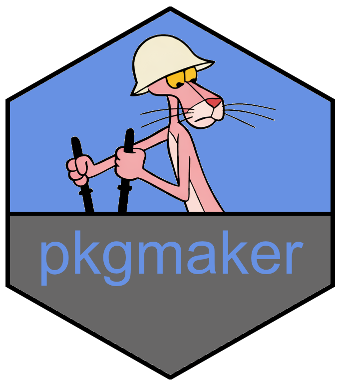

<!-- README.md is generated from README.Rmd. Please edit that file -->
# pkgmaker 
*transforma tus scripts a paquetes en r, con un archivo y 3 comandos*
<!-- badges: start -->


<!-- badges: end -->

## Descripción
pkgmaker es una herramienta CLI minimalista para convertir un directorio de scripts R en un paquete listo para usar. Diseñada para transformar el proceso lento y tedioso de desarrollar un paquete, en un workbench de prototipado: escribes los scripts, ejecutas un comando, y obtienes un paquete R válido con dependencias, documentación e instalado.

## Instalación
``` bash
git clone https://github.com/jcarocont/pkgname.git
cd pkgname
./configscript.fish
```
Asegúrate de que `~/.local/bin` esté en tu PATH.

## Uso

### Ensamblar paquete (mover scripts y crear estructura)
``` bash
pkgmaker nsmbl
```
Ignorar archivos:
``` bash
pkgmaker nsmbl --ignore file1 file2
```

### autoconfigurar el paquete
``` bash
pkgmaker build
```

### Instalar paquete
``` bash
pkgmaker install
```

## deps.toml
El archivo `deps.toml` permite configurar el paquete completo sin tocar el `DESCRIPTION` manualmente.

``` toml
[package]
name = "mypackage"
version = "0.1.0"
title = "Lo que hace el paquete"
description = "Descripción más larga del paquete."
license = "MIT"

[authors]
[[authors.person]]
name = "Jane Doe"
email = "jane@example.com"
role = ["aut", "cre"]

[[authors.person]]
name = "John Doe"
email = "john@example.com"
role = ["aut"]

[imports]
dplyr >= 1.1.0
ggplot2 >= 3.4.0
data.table
```

Todos los campos son opcionales — si `name` no está presente se usa el `basename` del directorio. Si `deps.toml` no existe, las dependencias se infieren desde `library()` / `require()`.

## Estructura
Después de `nsmbl`:

    .
    ├── R/
    ├── DESCRIPTION
    ├── NAMESPACE
    ├── man/
    ├── data/
    └── deps.toml

## Notas
- Diseñado para acelerar el desarrollo
- Sin dependencias de sistema más allá de R
- Funciona bien en entornos Unix (Linux/macos)


